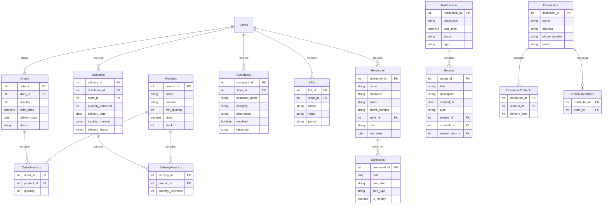

```mermaid
erDiagram
    Products {
        int product_id PK
        string name
        string barcode
        int min_quantity
        decimal price
        int stock
    }

    Orders {
        int order_id PK
        int store_id FK
        int quantity
        datetime order_date
        date delivery_date
        string status
    }

    Deliveries {
        int delivery_id PK
        int distributor_id FK
        int store_id FK
        int quantity_delivered
        date delivery_date
        string tracking_number
        string delivery_status
    }

    Complaints {
        int complaint_id PK
        int store_id FK
        string customer_name
        string category
        string description
        boolean resolved
        string response
    }

    KPIs {
        int kpi_id PK
        int store_id FK
        string metric
        string value
        string period
    }

    Personnel {
        int personnel_id PK
        string name
        string password
        string email
        string phone_number
        int store_id FK
        string role
        date hire_date
    }

    Distributors {
        int distributor_id PK
        string name
        string address
        string phone_number
        string email
    }

    Notifications {
        int notification_id PK
        string description
        datetime date_time
        string status
        string type
    }

    Reports {
        int report_id PK
        string title
        string description
        date created_at
        string type
        int related_id FK
        int created_by FK
        int related_store_id FK
    }

    OrderProducts {
        int order_id FK
        int product_id FK
        int quantity
    }

    DeliveryProducts {
        int delivery_id FK
        int product_id FK
        int quantity_delivered
    }

    DistributorProducts {
        int distributor_id FK
        int product_id FK
        int delivery_time
    }

    Schedules {
        int personnel_id FK
        date date
        string time_slot
        string shift_type
        boolean is_holiday
    }

    DistributorOrders {
        int distributor_id FK
        int order_id FK
    }

    Stores ||--o{ Orders : places
    Stores ||--o{ Complaints : receives
    Stores ||--o{ KPIs : monitors
    Stores ||--o{ Personnel : employs
    Stores ||--o{ Deliveries : receives
    Products ||--o{ OrderProducts : contains
    Products ||--o{ DeliveryProducts : contains
    Distributors ||--o{ DistributorProducts : supplies
    Distributors ||--o{ DistributorOrders : processes
    Orders ||--o{ OrderProducts : contains
    Deliveries ||--o{ DeliveryProducts : contains
    Personnel ||--o{ Schedules : works_on
    Notifications ||--o{ Reports : contains
```
