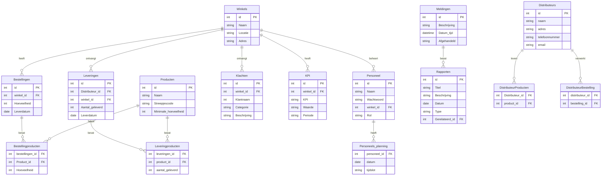

```mermaid
erDiagram
    Winkels {
        int id PK
        string Naam
        string Locatie
        string Adres
    }

    Producten {
        int id PK
        string Naam
        string Streepjescode
        int Minimale_hoeveelheid
    }

    Bestellingen {
        int id PK
        int winkel_id FK
        int Hoeveelheid
        date Leverdatum
    }

    Leveringen {
        int id PK
        int Distributeur_id FK
        int winkel_id FK
        int Aantal_geleverd
        date Leverdatum
    }

    Klachten {
        int id PK
        int winkel_id FK
        int Klantnaam
        string Categorie
        string Beschrijving
    }

    KPI {
        int id PK
        int winkel_id FK
        string KPI
        string Waarde
        string Periode
    }

    Personeel {
        int id PK
        string Naam
        string Wachtwoord
        int winkel_id FK
        string Rol
    }

    Distributeurs {
        int id PK
        string naam
        string adres
        string telefoonnummer
        string email
    }

    Meldingen {
        int id PK
        string Beschrijving
        datetime Datum_tijd
        string Afgehandeld
    }

    Rapporten {
        int id PK
        string Titel
        string Beschrijving
        date Datum
        string Type
        int Gerelateerd_id FK
    }

    Bestellingproducten {
        int bestellingen_id FK
        int Product_id FK
        int Hoeveelheid
    }

    Leveringproducten {
        int leveringen_id FK
        int product_id FK
        int aantal_geleverd
    }

    DistributeurProducten {
        int Distributeur_id FK
        int product_id FK
    }

    Personeels_planning {
        int personeel_id FK
        date datum
        string tijdslot
    }

    DistributeurBestelling {
        int distributeur_id FK
        int bestelling_id FK
    }

    Winkels ||--o{ Bestellingen : heeft
    Winkels ||--o{ Klachten : ontvangt
    Winkels ||--o{ KPI : heeft
    Winkels ||--o{ Personeel : beheert
    Winkels ||--o{ Leveringen : ontvangt
    Producten ||--o{ Bestellingproducten : bevat
    Producten ||--o{ Leveringproducten : bevat
    Distributeurs ||--o{ DistributeurProducten : levert
    Distributeurs ||--o{ DistributeurBestelling : verwerkt
    Bestellingen ||--o{ Bestellingproducten : bevat
    Leveringen ||--o{ Leveringproducten : bevat
    Personeel ||--o{ Personeels_planning : heeft
    Meldingen ||--o{ Rapporten : bevat
```
